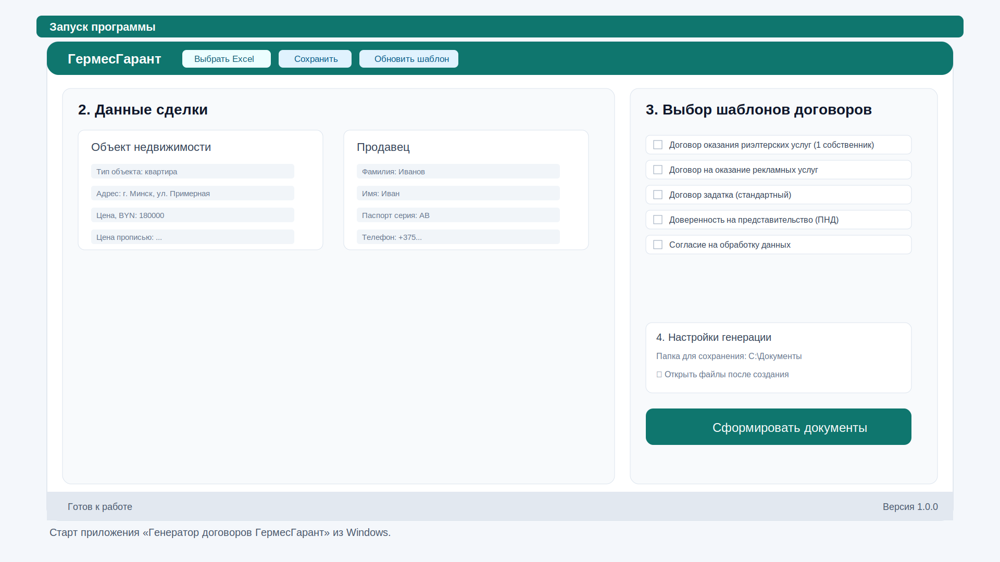
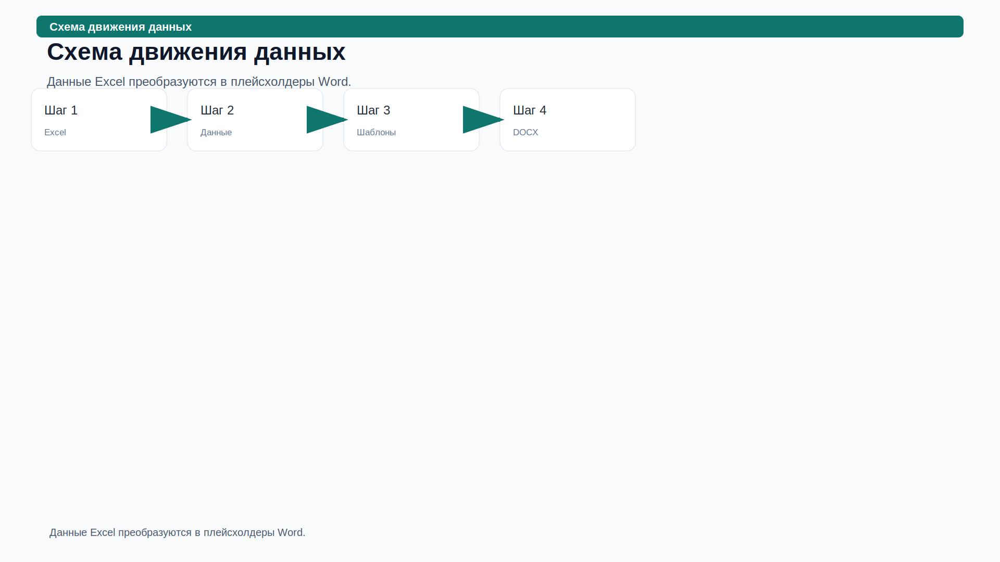
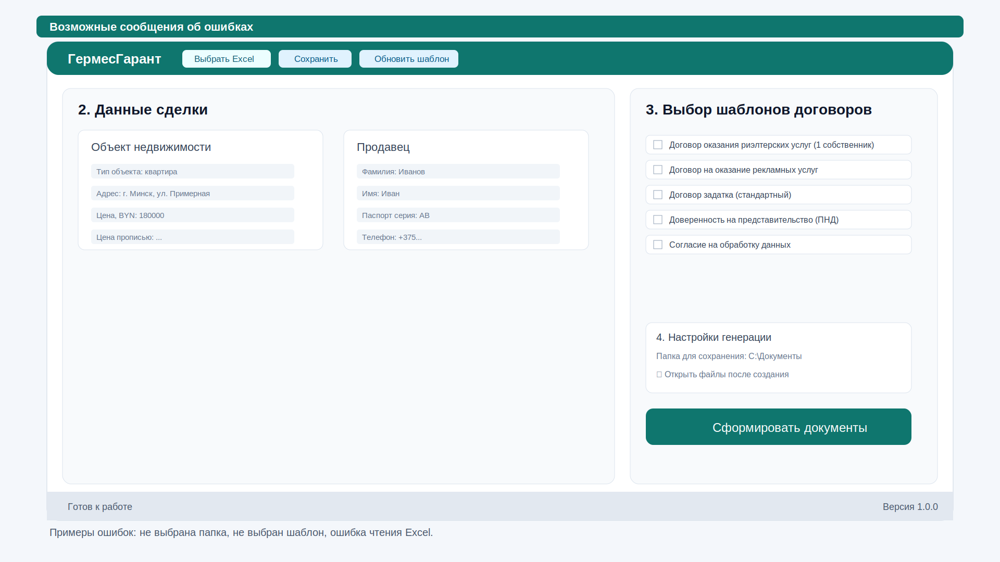
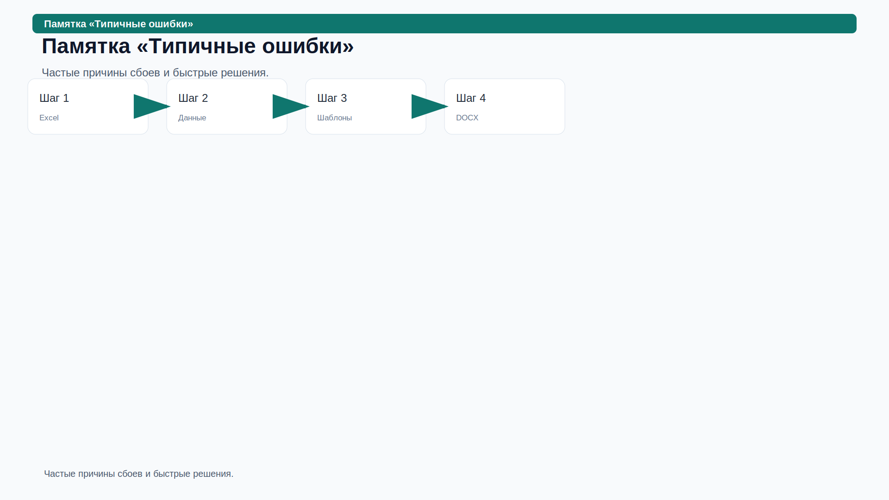
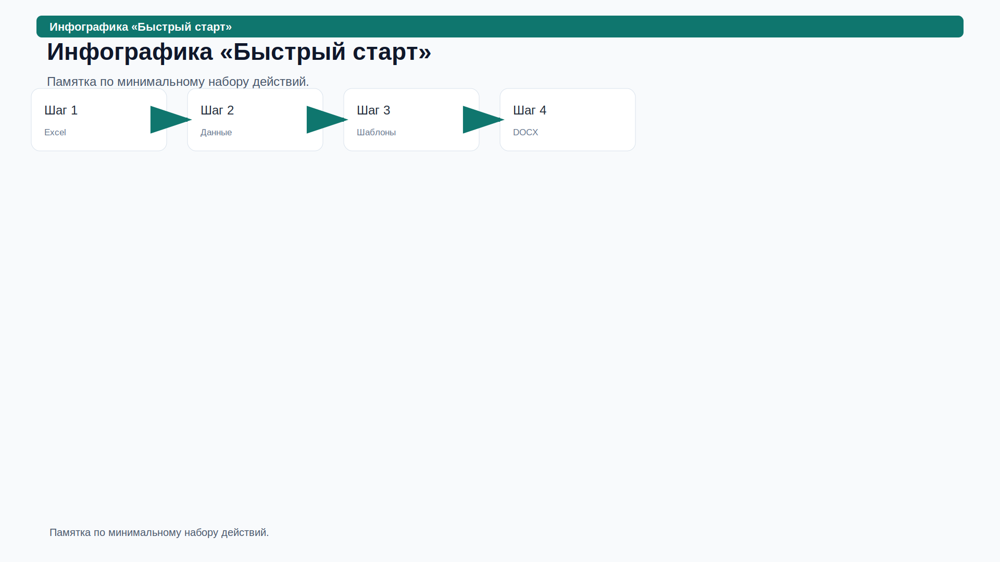
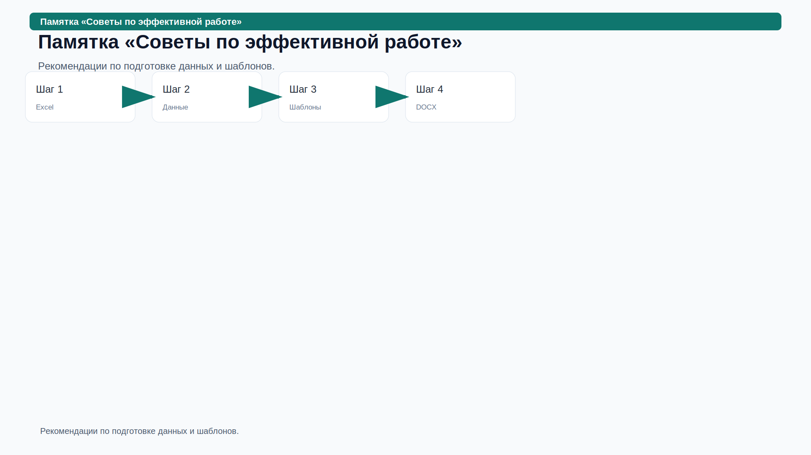
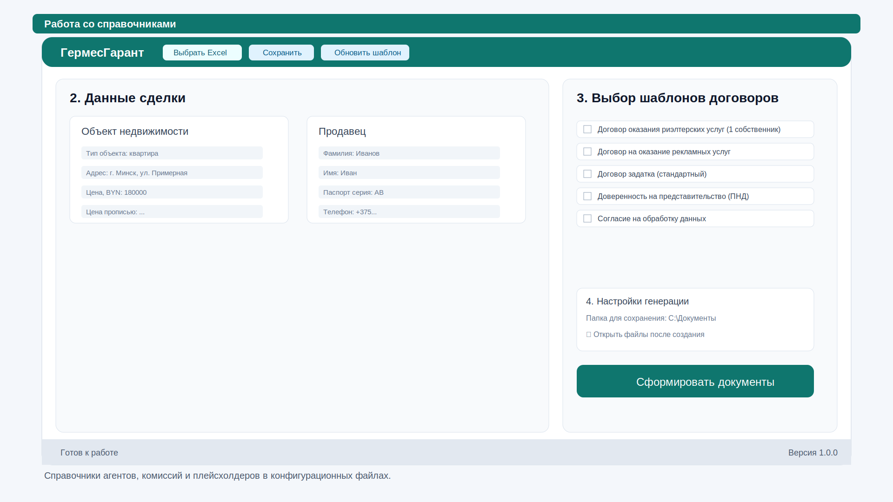
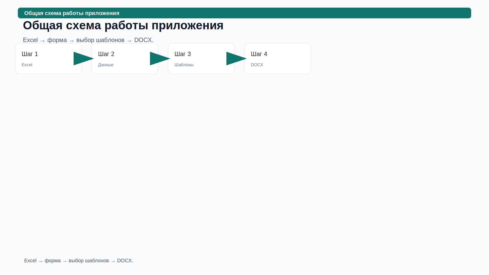
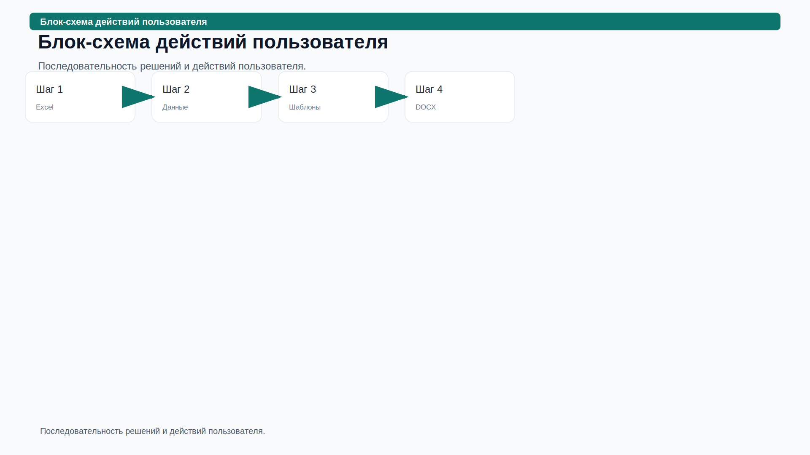

# Руководство пользователя

## Генератор договоров «ГермесГарант»

> Версия руководства: 1.0. Подготовлено по результатам анализа проекта Electron-приложения, структуры Excel, Word-шаблонов и логики генерации документов.

---

# 1. Общая информация

## 1.1. Назначение программы

«Генератор договоров ГермесГарант» — настольное Windows-приложение для подготовки пакета документов агентства недвижимости на основании данных сделки из Excel-файла. Программа загружает структурированный `.xlsx`, заполняет форму, рассчитывает отдельные значения, подставляет данные в Word-шаблоны `.docx` и сохраняет готовые документы в выбранную папку.

## 1.2. Основные возможности

| Возможность | Описание |
|---|---|
| Загрузка Excel | Чтение первого листа Excel по блокам `СДЕЛКА`, `ОБЪЕКТ`, `ПРОДАВЕЦ`, `СОБСТВЕННИК №1–3`, `ПОКУПАТЕЛЬ`. |
| Редактирование данных | Все прочитанные данные отображаются в форме и могут быть изменены пользователем. |
| Сохранение Excel | Программа может перезаписать исходный Excel или сохранить копию через «Сохранить как…». |
| Генерация Word | Создание одного или нескольких документов из шаблонов папки `templates/working`. |
| Предпросмотр | Текстовый предпросмотр выбранных шаблонов до создания файлов. |
| Автоматические расчёты | Стоимость BYN прописью, комиссия агентства, некоторые падежные формы ФИО и организаций. |
| Обновление формы | Кнопка «Обновить шаблон» пересканирует Excel-шаблон и обновляет конфигурацию полей формы. |

## 1.3. Требования к системе

- ОС: Windows 10/11 для конечного пользователя; разработческий запуск возможен там, где работает Electron.
- Память: рекомендуется от 4 ГБ ОЗУ.
- Дисковое пространство: не менее 200 МБ для приложения и места под документы.
- Для просмотра результата: Microsoft Word, LibreOffice Writer или другое приложение, открывающее `.docx`.
- Для исходных данных: Excel-файл формата `.xlsx`.

## 1.4. Запуск программы

1. Откройте ярлык **«Генератор договоров ГермесГарант»** на рабочем столе или в меню «Пуск».
2. Дождитесь появления главного окна.
3. Убедитесь, что в строке состояния отображается **«Готов к работе»**.

---

# 2. Интерфейс программы

## 2.1. Главное окно

Главное окно разделено на пять рабочих зон:

1. **Верхняя панель инструментов** — выбор Excel, сохранение, обновление шаблона.
2. **Левая панель данных** — путь к Excel, данные сделки, объект, продавец, покупатель, собственники и дополнительные поля.
3. **Правая панель шаблонов** — список Word-документов для формирования.
4. **Панель настроек генерации** — папка сохранения и дополнительные параметры.
5. **Строка состояния** — текущий статус: готовность, чтение файла, ошибки, несохранённые изменения.

## 2.2. Верхняя панель инструментов

| Элемент | Назначение | Когда используется | Ограничения |
|---|---|---|---|
| **ГермесГарант** | Название приложения/бренд. | Всегда отображается. | Не является кнопкой. |
| **Выбрать Excel** | Открывает диалог выбора `.xlsx`. | В начале работы или при смене сделки. | Принимаются только файлы `.xlsx`. |
| **Сохранить** | Записывает изменённые значения обратно в текущий Excel. | После ручного редактирования формы. | Недоступно, пока нет изменений. |
| **Сохранить как…** | Создаёт копию Excel с текущими данными. | Чтобы не менять исходный файл. | Доступно только после загрузки Excel. |
| **Обновить шаблон** | Сканирует Excel-шаблон и перестраивает список полей формы. | При изменении структуры Excel-шаблона. | После успешного сканирования окно перезагружается. |

## 2.3. Блок «1. Загрузка данных из Excel»

- **Файл Excel** — read-only поле с полным путём к выбранному файлу.
- **Файл успешно загружен** — зелёное сообщение с именем файла после успешного чтения.
- Пока файл не выбран, поле содержит подсказку: **«Файл не выбран — нажмите „Выбрать Excel“ на панели инструментов»**.

## 2.4. Блок «2. Данные сделки»

### Объект недвижимости

Содержит поля типа объекта, адреса, города, улицы, дома, корпуса/квартиры, этажей, комнат, площадей, кадастрового и инвентарного номера. Поля **Корпус / Квартира** и **Этаж / Этажность** визуально объединяются в пары.

### Стоимость и параметры сделки

| Поле | Особенность |
|---|---|
| Цена, USD | Обычное текстовое поле. |
| Цена, BYN | Проверяется как неотрицательное число с максимум двумя знаками после разделителя. |
| Цена прописью | Рассчитывается автоматически из цены BYN. |
| Комиссия агентства | Рассчитывается автоматически по тарифной таблице и недоступна для ручного ввода. |
| Даты договора | Поля даты поддерживают формат `ДД.ММ.ГГГГ`. |

### Продавец, покупатель, собственники

Для участников сделки используются одинаковые группы полей: ФИО, дата рождения, паспорт, идентификационный номер, кем и когда выдан, адрес регистрации, телефон. Для собственников дополнительно есть **Доля собственности**.

### Вкладки собственников

Доступны вкладки:

- **Собственник 1**;
- **Собственник 2**;
- **Собственник 3**.

Количество заполненных собственников влияет на доступность шаблонов договоров с 1, 2 или 3 собственниками.

## 2.5. Правая панель «3. Выбор шаблонов договоров»

Шаблоны сгруппированы по назначению.

### Основные договоры риэлтерских услуг

- Договор оказания риэлтерских услуг (1 собственник, общий).
- Договор оказания риэлтерских услуг (1 собственник, эксклюзив).
- Договор оказания риэлтерских услуг (2 собственника, общий).
- Договор оказания риэлтерских услуг (2 собственника, эксклюзив).
- Договор оказания риэлтерских услуг (3 собственника, общий).
- Договор оказания риэлтерских услуг (3 собственника, эксклюзив).
- Договор оказания риэлтерских услуг (физическое лицо — коммерческая структура).

### Договоры и соглашения

- Договор задатка (стандартный).
- Договор на оказание рекламных услуг.
- Договор о конвертации валюты.
- Договор хранения имущества.
- Соглашение о расторжении.

> **Важно:** «Договор хранения имущества» есть в интерфейсе, но в текущей версии не реализован в реестре генерации. При выборе только этого шаблона программа покажет сообщение **«Выбранные шаблоны ещё не реализованы»**.

### Дополнительные документы

- Доверенность на представительство (ПНД).
- Запрос на ПНД.
- Запрос в РСЦ.
- Согласие на обработку данных.
- Расписка в получении ключей.

## 2.6. Настройки генерации

| Элемент | Назначение |
|---|---|
| **Папка для сохранения** | Путь, куда будут записаны готовые `.docx`. |
| **Обзор** | Открывает выбор папки. |
| **Открыть файлы после создания** | Если включено, каждый успешно созданный документ открывается системным приложением. |
| **Добавить дату к имени файла** | Добавляет к имени документа текущую дату в формате `_ДД-ММ-ГГГГ`. |

## 2.7. Действия

- **Сформировать документы** — запускает генерацию выбранных шаблонов.
- **Предварительный просмотр** — открывает модальное окно с текстом выбранных шаблонов. Форматирование в предпросмотре может отличаться от итогового Word.

## 2.8. Уведомления, индикаторы и диалоги

- Верхний баннер ошибки показывает критичные ошибки чтения и диалогов.
- Toast-уведомления показывают краткие результаты: успешное сохранение, невыбранные шаблоны, ошибки генерации.
- Loader **«Чтение файла…»** появляется во время загрузки Excel.
- При закрытии окна с несохранёнными изменениями появляется диалог **«Несохраненные изменения»** с кнопками **«💾 Сохранить»**, **«❌ Не сохранять»**, **«↩ Отмена»**.

---

# 3. Порядок работы

## Шаг 1. Запустите программу

Откройте приложение и дождитесь статуса **«Готов к работе»**.

## Шаг 2. Загрузите Excel-файл

1. Нажмите **Выбрать Excel**.
2. В диалоге выберите файл `.xlsx`.
3. Нажмите **Открыть**.
4. Дождитесь сообщения **«Файл успешно загружен»**.

## Шаг 3. Проверьте основные данные

Просмотрите блоки **Объект недвижимости**, **Продавец**, **Покупатель**. При необходимости исправьте значения прямо в форме. Изменённые поля подсвечиваются как несохранённые.

## Шаг 4. Заполните собственников и дополнительные поля

Переключайтесь между вкладками **Собственник 1–3**. Заполняйте только тех собственников, которые реально участвуют в сделке. Если продавец является собственником, в поле **Является собственником** укажите `да`.

## Шаг 5. Проверьте данные

Нажмите **Проверить данные**. Программа проверяет базовый минимум:

- дату договора;
- тип договора;
- адрес объекта;
- фамилию продавца;
- фамилию покупателя.

## Шаг 6. Выберите шаблоны

Отметьте один или несколько документов. Используйте **Выбрать все** для массового выбора доступных шаблонов и **Снять все** для очистки выбора.

## Шаг 7. Выберите папку сохранения

Нажмите **Обзор** в блоке настроек генерации и выберите папку. Без папки генерация не начнётся.

## Шаг 8. При необходимости откройте предпросмотр

Нажмите **Предварительный просмотр**. В окне предпросмотра переключайтесь между вкладками документов. Закрыть окно можно кнопкой **Закрыть**, крестиком или клавишей `Esc`.

## Шаг 9. Сформируйте документы

Нажмите **Сформировать документы**. После завершения появится сообщение вида **«✔ Сформировано: 3 из 3»**.

## Шаг 10. Проверьте готовые файлы

Откройте выбранную папку или дождитесь автоматического открытия файлов, если включён параметр **Открыть файлы после создания**.

---

# 4. Работа с шаблонами

## 4.1. Где находятся шаблоны

Word-шаблоны находятся в папке `templates/working`. Исходный пример также есть в `templates/Original`.

## 4.2. Какие шаблоны поддерживаются

Поддерживаются реализованные шаблоны из реестра генерации: доверенность ПНД, расписка ключей, рекламный договор, соглашение о расторжении, запросы ПНД/РСЦ, согласие на обработку данных, договоры риэлтерских услуг для 1–3 собственников, договор конвертации, договор задатка, договор физического лица с коммерческой структурой.

## 4.3. Как выбираются шаблоны

1. В правой панели найдите нужную группу.
2. Поставьте флажок слева от названия документа.
3. Если шаблон недоступен, наведите курсор: подсказка объяснит несоответствие количества собственников.

## 4.4. Как добавить новый шаблон

Для разработчика или администратора шаблонов:

1. Поместить `.docx` в `templates/working`.
2. Добавить пункт с `data-template` в интерфейс.
3. Добавить обработчик генерации в `main.js`.
4. Добавить запись в `TEMPLATE_REGISTRY`.
5. Использовать плейсхолдеры формата `{{seller.fullName}}`, `{{deal.date}}`, `{{property.address}}`.

## 4.5. Что происходит при отсутствии обязательных данных

Docxtemplater подставляет пустую строку для отсутствующих значений. Поэтому документ может сформироваться, но в нём будут пустые места. Перед генерацией обязательно используйте **Проверить данные** и визуально проверьте предпросмотр.

---

# 5. Работа с Excel

## 5.1. Как загружается Excel

Программа читает первый лист книги `.xlsx`. Лист должен содержать блоки-заголовки в колонке A и значения в колонке B.

## 5.2. Какие блоки используются

| Заголовок в Excel | Блок в программе |
|---|---|
| `СДЕЛКА` | deal |
| `ОБЪЕКТ` | property |
| `ПРОДАВЕЦ` | seller |
| `СОБСТВЕННИК №1` | owner1 |
| `СОБСТВЕННИК №2` | owner2 |
| `СОБСТВЕННИК №3` | owner3 |
| `ПОКУПАТЕЛЬ` | buyer |

## 5.3. Какие поля считываются

Колонка A содержит название поля, колонка B — значение. Даты приводятся к виду `ДД.ММ.ГГГГ`. Формулы, rich text и текстовые ячейки преобразуются в строку. Поле **Комиссия агентства** из Excel не читается, потому что рассчитывается приложением.

## 5.4. Возможные ошибки Excel

| Ошибка | Причина | Решение |
|---|---|---|
| `Файл не содержит листов` | В книге нет рабочих листов. | Создайте лист с данными или выберите другой файл. |
| `Ошибка при чтении файла: ...` | Файл повреждён, занят другим процессом или имеет неверный формат. | Закройте Excel, проверьте расширение `.xlsx`, попробуйте открыть файл вручную. |
| `Файл прочитан, но данные не получены. Проверьте формат файла.` | Reader вернул некорректный объект. | Проверьте структуру блоков и колонок A/B. |

---

# 6. Генерация документов

## 6.1. Как происходит создание документа

1. Пользователь выбирает шаблоны.
2. Программа собирает данные формы в объект плейсхолдеров.
3. Для каждого шаблона открывается соответствующий `.docx`.
4. Плейсхолдеры `{{...}}` заменяются данными.
5. Итоговый файл сохраняется в выбранную папку.

## 6.2. Куда сохраняется документ

В папку, выбранную в поле **Папка для сохранения**. Если включён флажок **Добавить дату к имени файла**, к базовому имени добавляется текущая дата.

## 6.3. Что делать при ошибках генерации

- Проверьте, выбран ли хотя бы один реализованный шаблон.
- Проверьте, выбрана ли папка сохранения.
- Закройте ранее открытый файл с таким же именем, если редактор блокирует запись.
- Проверьте плейсхолдеры в Word-шаблоне.

---

# 7. Возможные ошибки

| Текст ошибки/сообщения | Возможная причина | Как исправить |
|---|---|---|
| `Не удалось открыть диалог выбора файла: ...` | Сбой системного диалога. | Перезапустите приложение. |
| `Ошибка при чтении файла: ...` | Excel повреждён, недоступен или не соответствует `.xlsx`. | Откройте файл в Excel, сохраните копию `.xlsx`, повторите загрузку. |
| `Файл прочитан, но данные не получены. Проверьте формат файла.` | Нарушена структура шаблона. | Проверьте блоки и колонки A/B. |
| `✖ Не удалось сохранить файл: ...` | Нет доступа к файлу или файл открыт в Excel. | Закройте файл и проверьте права на папку. |
| `✖ Сначала выберите папку для сохранения документов` | Поле папки пустое. | Нажмите **Обзор** и выберите папку. |
| `✖ Выберите хотя бы один шаблон` | Не отмечен ни один шаблон. | Отметьте нужные документы. |
| `Выбранные шаблоны ещё не реализованы` | Выбран пункт интерфейса без обработчика генерации. | Выберите другой шаблон или обратитесь к разработчику. |
| `Шаблон не найден: ...` | Нет соответствия ключа шаблона файлу. | Проверьте наличие файла в `templates/working`. |
| `Есть несохраненные изменения. Что сделать?` | Пользователь закрывает окно после правок. | Выберите «Сохранить», «Не сохранять» или «Отмена». |

---

# 8. Часто задаваемые вопросы (FAQ)

## Можно ли сформировать несколько документов сразу?

Да. Отметьте несколько шаблонов и нажмите **Сформировать документы**.

## Почему часть договоров недоступна?

Договоры с 1, 2 и 3 собственниками включаются в зависимости от заполненных данных собственников и поля **Является собственником**.

## Почему комиссия недоступна для ввода?

Комиссия рассчитывается автоматически из стоимости BYN и тарифной таблицы.

## Можно ли использовать запятую в цене BYN?

Да, запятая нормализуется как десятичный разделитель. Допустимо не более двух знаков после разделителя.

## Что делать, если Word-документ создался с пустыми местами?

Заполните недостающие поля в форме или Excel и создайте документ заново.

---

# 9. Советы по работе

- Перед генерацией всегда нажимайте **Проверить данные**.
- Храните исходные Excel отдельно от сформированных документов.
- Для важных сделок используйте **Сохранить как…**, чтобы не перезаписать исходник.
- Заполняйте данные в одном стиле: даты `ДД.ММ.ГГГГ`, телефоны в едином формате, ФИО без лишних пробелов.
- Не переименовывайте Word-шаблоны без обновления кода.
- Перед массовой генерацией проверьте один документ через предпросмотр.

---

# 10. Горячие клавиши

| Сочетание | Где работает | Действие |
|---|---|---|
| `Esc` | Окно предпросмотра | Закрывает предпросмотр. |

Другие пользовательские сочетания клавиш в текущей версии не реализованы.

---

# 11. Приложение

## 11.1. Структура каталогов

| Путь | Назначение |
|---|---|
| `main.js` | Главное окно Electron и IPC-обработчики. |
| `preload.js` | Безопасный мост между интерфейсом и Electron API. |
| `index.html` | Каркас интерфейса. |
| `js/app.js` | Основная логика формы, генерации, предпросмотра. |
| `js/form-builder.js` | Динамическое построение полей формы. |
| `fields-config.json` | Источник описаний полей. |
| `excel/excel-reader.js` | Чтение Excel. |
| `excel/excel-scanner.js` | Сканирование Excel-шаблона для обновления формы. |
| `generator/word-generator.js` | Генерация и предпросмотр Word. |
| `templates/working` | Рабочие Word-шаблоны. |
| `output` | Пример папки вывода. |
| `config/agents.json` | Справочник риэлтеров. |
| `config/commission-rates.json` | Тарифная таблица комиссии. |
| `config/placeholders.json` | Описание плейсхолдеров Word. |

## 11.2. Создаваемые файлы

- `.docx` — итоговые документы Word.
- `.xlsx` — обновлённые или сохранённые копии Excel-сделок.

## 11.3. Используемые форматы

| Формат | Роль |
|---|---|
| `.xlsx` | Входные данные и сохраняемые сделки. |
| `.docx` | Word-шаблоны и готовые документы. |
| `.json` | Конфигурации полей, агентов, комиссий, плейсхолдеров. |
| `.js`, `.html`, `.css` | Код приложения. |

## 11.4. Резервное копирование

Рекомендуется регулярно копировать:

- `templates/working`;
- `excel/*.xlsx`;
- `config/*.json`;
- рабочие папки со сделками и результатами.

---

# 12. Иллюстрации и изображения

## 12.1. Список рисунков

| № | Файл | Раздел | Подпись |
|---:|---|---|---|
| 1 | `images/01-launch.svg` | 1. Общая информация | Старт приложения «Генератор договоров ГермесГарант» из Windows. |
| 2 | `images/02-main-window.svg` | 2. Интерфейс программы | Главное окно с левой областью данных и правой областью шаблонов. |
| 3 | `images/03-interface-callouts.svg` | 2. Интерфейс программы | Основные зоны интерфейса: панель инструментов, формы, шаблоны, настройки и статус. |
| 4 | `images/04-template-selection.svg` | 4. Работа с шаблонами | Выбор одного или нескольких Word-шаблонов для генерации. |
| 5 | `images/05-excel-load.svg` | 5. Работа с Excel | Диалог выбора и индикатор успешной загрузки Excel-файла. |
| 6 | `images/06-main-data.svg` | 3. Порядок работы | Поля объекта недвижимости, продавца и покупателя. |
| 7 | `images/07-extra-fields.svg` | 3. Порядок работы | Вкладки собственников и дополнительные данные сделки. |
| 8 | `images/08-data-check.svg` | 3. Порядок работы | Кнопка «Проверить данные» и уведомление о результате проверки. |
| 9 | `images/09-generation.svg` | 6. Генерация документов | Запуск формирования выбранных документов. |
| 10 | `images/10-save-document.svg` | 6. Генерация документов | Выбор папки сохранения и параметров именования файлов. |
| 11 | `images/11-document-view.svg` | 6. Генерация документов | Открытие готового DOCX-файла в Microsoft Word или другом редакторе. |
| 12 | `images/12-errors.svg` | 7. Возможные ошибки | Примеры ошибок: не выбрана папка, не выбран шаблон, ошибка чтения Excel. |
| 13 | `images/13-settings.svg` | 2. Интерфейс программы | Настройки генерации: папка, открытие после создания, добавление даты. |
| 14 | `images/14-directories.svg` | 11. Приложение | Справочники агентов, комиссий и плейсхолдеров в конфигурационных файлах. |
| 15 | `images/15-multiple-templates.svg` | 4. Работа с шаблонами | Одновременный выбор нескольких документов. |
| 16 | `images/16-full-example.svg` | 3. Порядок работы | Цепочка от загрузки Excel до получения готового документа. |
| 17 | `images/17-workflow.svg` | 11. Приложение | Excel → форма → выбор шаблонов → DOCX. |
| 18 | `images/18-flowchart.svg` | 3. Порядок работы | Последовательность решений и действий пользователя. |
| 19 | `images/19-data-flow.svg` | 5. Работа с Excel | Данные Excel преобразуются в плейсхолдеры Word. |
| 20 | `images/20-quick-start.svg` | 9. Советы по работе | Памятка по минимальному набору действий. |
| 21 | `images/21-common-errors.svg` | 7. Возможные ошибки | Частые причины сбоев и быстрые решения. |
| 22 | `images/22-tips.svg` | 9. Советы по работе | Рекомендации по подготовке данных и шаблонов. |

## 12.2. Рекомендации по размещению изображений

- Схемы процесса размещайте в начале соответствующих разделов.
- Скриншоты интерфейса ставьте перед пошаговыми инструкциями.
- Памятки «Быстрый старт», «Типичные ошибки» и «Советы» удобно вынести в конец PDF или распечатать отдельно.

---

# Структура будущего PDF

1. Титульный лист.
2. Оглавление.
3. Общая информация.
4. Интерфейс программы.
5. Порядок работы.
6. Работа с шаблонами.
7. Работа с Excel.
8. Генерация документов.
9. Ошибки и FAQ.
10. Советы, горячие клавиши, приложение.
11. Список рисунков.

# Структура DOCX

- Использовать стили: `Заголовок 1`, `Заголовок 2`, `Заголовок 3`, `Обычный`, `Таблица`.
- Каждый раздел H1 начинать с новой страницы.
- Иллюстрации вставлять по ширине страницы с подписью под рисунком.
- Таблицы ошибок и полей оставить редактируемыми.

# Предложения по улучшению интерфейса

1. **Сделать поле «Является собственником» выпадающим списком** со значениями `да/нет`, чтобы исключить ошибки ввода.
2. **Скрыть или пометить «Договор хранения имущества» как недоступный**, пока генерация не реализована.
3. **Добавить явную кнопку «Открыть папку с результатами»** после генерации.
4. **Показывать список созданных файлов** в отдельном окне или панели результата.
5. **Добавить расширенную проверку обязательных полей** для каждого выбранного шаблона, а не только базовую проверку пяти полей.
6. **Добавить маски ввода дат и телефонов** для уменьшения ошибок.
7. **Добавить справочный раздел прямо в приложение**: краткий сценарий, требования к Excel, список ошибок.
8. **Добавить управление справочниками агентов и комиссий через интерфейс**, чтобы пользователю не приходилось редактировать JSON.
9. **Добавить предупреждение о пустых плейсхолдерах перед генерацией**, если выбранный шаблон требует незаполненных данных.
10. **Разделить действия «сохранить Excel» и «создать Word» визуально сильнее**, чтобы новые пользователи не путали эти операции.
